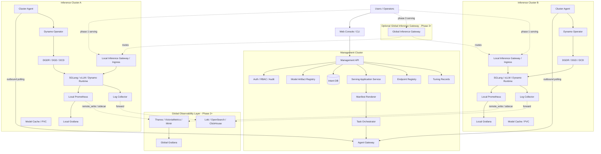
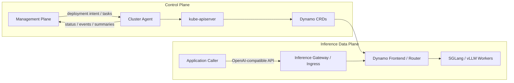
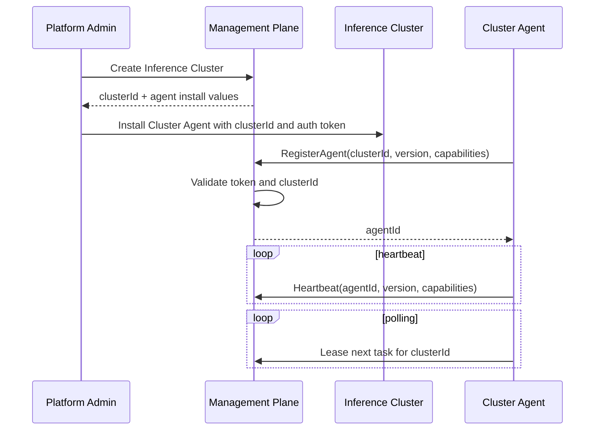
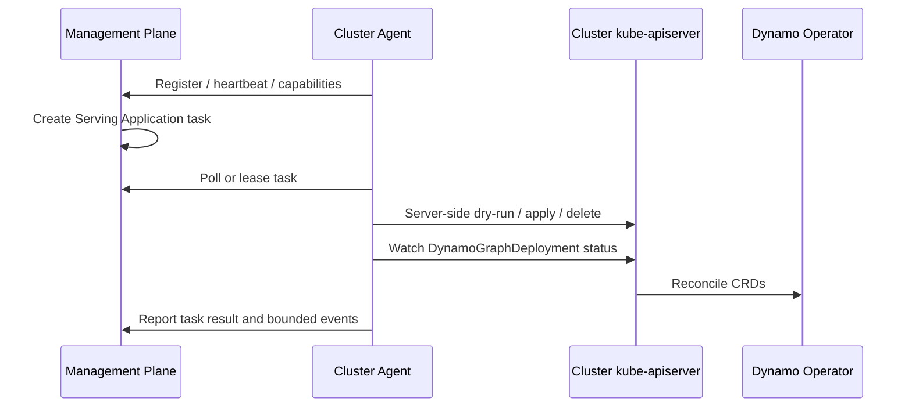
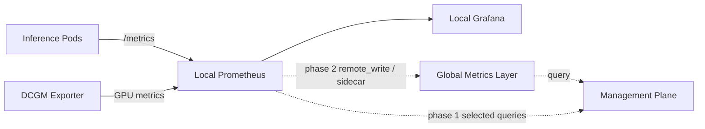
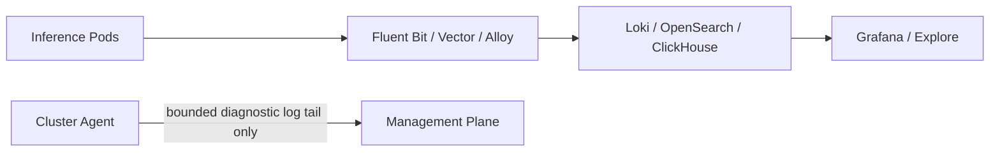
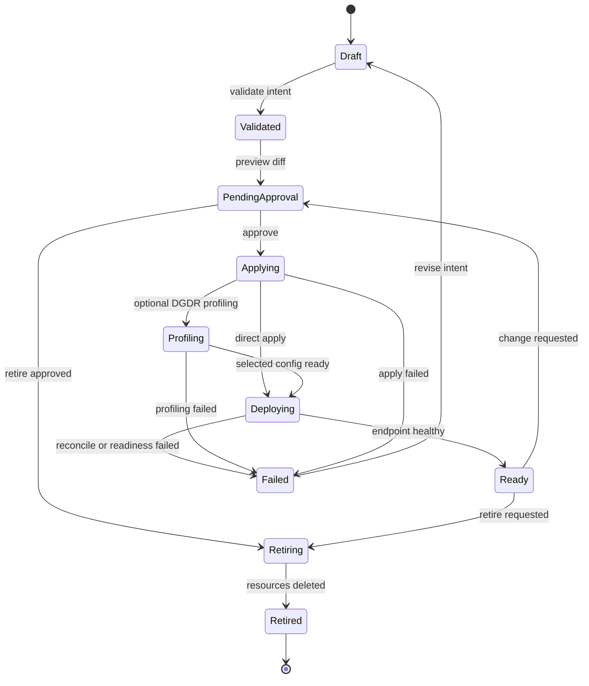

# Inference Platform Architecture

This document describes the target architecture for managing large-model inference deployments across heterogeneous accelerator clusters. It focuses on deployment, monitoring, tracking, and tuning for models such as DeepSeek V4 Flash/Pro, GLM, and Kimi.

## Architecture Principles

- Keep the **Management Plane** out of GPU-serving failure domains.
- Keep online inference traffic out of the **Management Plane** by default.
- Use Kubernetes and Dynamo CRDs as the execution layer instead of replacing the operator.
- Keep full metrics and logs in observability systems, not in the platform database.
- Start with cluster-local dashboards and evolve toward global observability only when scale requires it.
- Treat accelerator diversity as a first-class product concern through vendor-neutral resource abstractions.
- Build Phase 1 API-first and Cluster-Agent-first before polishing the Web Console.

## Overall Architecture



## Control Plane vs Data Plane



The **Management Plane** manages lifecycle and governance. The inference serving path should not traverse the Management Plane by default.

## Module Responsibilities

### Management Plane

Phase 1 is API-first. The Management API and domain services define the stable contract, while the Web Console starts with the minimum pages required to drive the deployment loop.

| Module | Responsibilities | Stores Runtime Truth? |
|---|---|---|
| Web Console | Deployment workspace, resource views, monitoring entry points, tuning history | No |
| Management API | Product API for Projects, clusters, artifacts, Serving Applications, tasks, endpoints, and audit | No |
| Auth / RBAC / Audit | User identity, authorization, approval records, operation history | No |
| Project Service | Product boundary for users, permissions, Serving Applications, and resource access | No |
| Cluster Registry | Inference Cluster identity, Agent registration state, capabilities, heartbeat, observability URLs | No |
| Model Artifact Registry | Cached model artifact metadata, revision, cache path, PVC reference, quantization, compatibility | No |
| Serving Application Service | Product lifecycle object, desired intent, phase, active version, endpoint references | No |
| Manifest Renderer | Converts Serving Application intent into platform-generated Dynamo manifests | No |
| Task Orchestrator | Creates whitelist tasks, leases, retries, idempotency keys, and task result records | No |
| Agent Gateway | Authenticates agents and receives heartbeats, polling requests, status, events, and results | No |
| Endpoint Registry | Stores cluster-local serving URLs and ownership | No |
| Observability Entry Service | Stores Grafana deep links and selected Prometheus query templates | No |
| Tuning Records | Profiling runs, benchmark summaries, Planner settings, recommendations | No |

Runtime truth remains in each **Inference Cluster** through Kubernetes resources, Dynamo CRD status, Prometheus, and logs.

### Cluster Agent

The Cluster Agent is a whitelist task executor, not a general-purpose remote Kubernetes administration tunnel. It should be implemented early because the end-to-end deployment loop depends on registration, polling, task execution, status watch, and safe redeploy behavior.

| Capability | Responsibility |
|---|---|
| Registration | Registers cluster identity, version, capabilities, and resource labels |
| Heartbeat | Reports liveness and current Agent version |
| Task polling | Uses outbound polling to claim approved tasks from the Management Plane |
| Task leases | Ensures one Agent executes a task at a time and enables retry after Agent failure |
| Kubernetes apply | Applies platform-generated Dynamo resources through local RBAC |
| Server-side dry-run | Runs `kubectl apply --dry-run=server` for generated manifests |
| Status watch | Watches DynamoGraphDeployment status and maps it back to task results |
| Safe redeploy | Supports delete-before-apply workflows for scarce accelerator clusters |
| Retire | Deletes platform-owned deployment resources and waits for deletion |
| Observability bridge | Reports small status summaries and dashboard links; does not forward full metrics/logs |
| Diagnostics | Provides bounded log tail, selected events, and health checks for troubleshooting |

Explicitly excluded capabilities:

- Arbitrary `kubectl` command execution.
- Arbitrary YAML apply from users.
- Broad cluster administration outside platform-owned serving resources.
- Full metrics or log forwarding.

### Inference Cluster

| Module | Responsibility |
|---|---|
| Dynamo Operator | Reconciles DynamoGraphDeploymentRequest, DynamoGraphDeployment, and component resources |
| SGLang / vLLM Runtime | Runs model-serving workers and exposes runtime metrics |
| Local Inference Gateway / Ingress | Exposes serving API for the cluster |
| Local Prometheus | Scrapes cluster, GPU, Dynamo, planner, frontend, router, and worker metrics |
| Local Grafana | Hosts cluster-local dashboards and drill-down panels |
| Log Pipeline | Sends pod logs to a local or global log store |
| Model Cache | Provides cached model artifacts through PVC or equivalent shared storage |

### Optional Global Inference Gateway

The Global Inference Gateway is not required for Phase 1. Add it when callers need one unified endpoint, cross-cluster routing, failover, global quota, or centralized billing.

| Responsibility | Notes |
|---|---|
| Unified API endpoint | Example: `https://api.example.com/v1/chat/completions` |
| Model-aware routing | Routes by model, tenant, region, accelerator pool, health, and capacity |
| Auth / rate limit / quota | Applies online request controls independent from management RBAC |
| Metering | Emits request, token, latency, and error records for billing or chargeback |
| Failover | Moves traffic away from unhealthy cluster endpoints when safe |

## Communication Patterns

### Management Plane to Cluster Agent

Recommended progression:

1. **Phase 1**: Agent outbound polling for tasks, heartbeats, status, and bounded events.
2. **Production**: Agent outbound mTLS WebSocket or gRPC bidirectional stream when lower-latency progress streaming is required.
3. **Large scale**: Add queue-backed task distribution if cluster count or task volume demands it.

Phase 1 polling requirements:

- Agents initiate all connections to the Management Plane.
- Tasks use leases so only one Agent can execute a task at a time.
- Task results are idempotent and can be retried safely after reconnect.
- Status and event sync use cursors to avoid resending unbounded history.
- Polling is not used for raw metrics or log forwarding.

### Cluster Agent Registration

Phase 1 uses an explicit cluster registration workflow. The Management Plane owns the Inference Cluster record; the Cluster Agent proves it is the in-cluster representative for that record.

Registration flow:

1. A platform admin creates an **Inference Cluster** record in the Management Plane.
2. The Management Plane returns the `clusterId` and the operator provisions a Cluster Agent in that target cluster.
3. The Cluster Agent starts with:
   - Management API URL.
   - `clusterId`.
   - Agent auth token.
   - Agent version.
   - Capability metadata such as `dynamo=true`, `backend=vllm`, `backend=sglang`, `prometheus`, or cluster labels.
4. The Cluster Agent sends `RegisterAgent` to the Management Plane using outbound HTTP.
5. The Management Plane validates auth, verifies the `clusterId` exists, creates or updates the **Cluster Agent** record, and stores capability metadata.
6. The Cluster Agent sends periodic heartbeats with version and capabilities.
7. Only after registration succeeds does the Cluster Agent poll for tasks for its `clusterId`.



Security and lifecycle notes:

- Phase 1 uses a static bearer token MVP; production should replace this with per-agent credentials or mTLS.
- The Management Plane should not store a broad kubeconfig for the Inference Cluster.
- Agent capabilities are advisory metadata for validation and UI; cluster-local RBAC remains the enforcement boundary.
- Re-registering an Agent for the same `clusterId` updates the existing Agent record rather than creating many active agents for one cluster.
- If heartbeats stop, the cluster should be shown as unavailable for new deployment tasks until the Agent recovers.



### Monitoring Data Path



Do not forward full Prometheus metrics through the Cluster Agent. The agent only reports summaries, status, and links.

### Logging Data Path



## Serving Endpoint Strategy

### Phase 1: Cluster-local endpoints

Each Inference Cluster exposes its own serving URL. The Management Plane stores and displays these URLs in the Endpoint Registry.

```text
https://deepseek-v4-pro.cluster-a.example.com/v1/chat/completions
https://deepseek-v4-pro.cluster-b.example.com/v1/chat/completions
```

Use this when the priority is fast implementation, strong fault isolation, private cluster support, and minimal traffic-plane complexity.

### Phase 3+: Global endpoint

A Global Inference Gateway exposes one API URL and routes to healthy cluster-local endpoints.

```text
https://api.example.com/v1/chat/completions
```

Use this when callers need a unified endpoint, global quota, centralized metering, cross-cluster failover, or model-aware routing.

## Deployment Lifecycle Baseline

Phase 1 uses a conservative lifecycle for DeepSeek V4 deployments:



Sparse accelerator clusters use delete-before-apply for material deployment changes:

1. Inspect current Serving Application runtime resources.
2. Generate and review the target resource diff.
3. Delete the old graph deployment and wait for GPU pods to terminate.
4. Clean up leftover platform-owned resources when needed.
5. Apply the new DGDR/DGD resources.
6. Watch readiness, endpoint health, and key metrics.

This avoids relying on default rolling updates that may require extra GPUs the cluster does not have.

## Observability UI Strategy

### MVP

- Keep the existing Grafana in each Inference Cluster.
- Management Plane stores Grafana dashboard URLs and selected Prometheus query templates.
- Deployment list pages show a small set of summary metrics from local Prometheus.
- Deployment detail pages deep-link to the cluster-local Grafana dashboard.
- Phase 1 does not iframe Grafana dashboards into the Web Console.

### Production

- Add Thanos, VictoriaMetrics, or Mimir as a global metrics layer.
- Configure each cluster Prometheus to remote-write or attach sidecars.
- Add global Grafana with one global datasource.
- Management Plane queries global metrics for cross-cluster fleet views, SLO summaries, and alert aggregation.

## Core Domain Objects

| Object | Meaning |
|---|---|
| Management Plane | Product-facing control environment for deployment lifecycle and governance |
| Project | Product boundary for users, permissions, Serving Applications, and allowed resource access |
| Inference Cluster | Kubernetes cluster that runs model-serving workloads on accelerator resources |
| Cluster Agent | Trusted in-cluster representative of the Management Plane |
| Serving Application | User-facing model service with deployment intent, runtime status, and history |
| Model Artifact | Concrete checkpoint or local snapshot that can be served |
| Serving Topology | Runtime shape such as aggregated serving or prefill-decode disaggregation |
| Accelerator Pool | Schedulable group of accelerator resources with shared operational characteristics |
| Optimization Profile | Performance targets, profiling results, and tuning observations |

### Serving Application Baseline Model

A Phase 1 Serving Application should describe product intent and lifecycle, not mirror every Kubernetes runtime object.

| Area | Baseline Fields |
|---|---|
| Identity | name, owning Project, owner, labels |
| Model intent | model family, cached model artifact, revision, quantization, local cache requirement |
| Placement intent | target Inference Cluster, Accelerator Pool constraints, minimum accelerator requirements, cluster-side namespace |
| Runtime intent | backend, Serving Topology, deployment recipe, environment variables, secrets references |
| Service intent | endpoint name, serving protocol, public/private exposure mode |
| Optimization intent | SLA target, optimization target, profiling mode, Planner mode when enabled |
| Lifecycle | desired state, current phase, last transition, active version, previous versions |
| Governance | created by, approved by, change reason, audit references |
| Observability references | Grafana dashboard URL, Prometheus query templates, log query references |

Phase 1 Model Artifact boundary:

- Model Artifacts must already exist in the target cluster's model cache or shared storage.
- The Management Plane records artifact identity, revision, cache path, PVC reference, quantization, and compatibility metadata.
- The Management Plane does not download, distribute, or synchronize model weights in Phase 1.

Excluded from the baseline model:

- Full DGDR/DGD/DCD object copies.
- Full pod, service, replica set, event, or metric histories.
- Raw Prometheus time series.
- Full application logs.

## Phase 1 Implementation Scope

Phase 1 prioritizes the Management Plane and Cluster Agent control loop.

### Implemented MVP slices in `src/`

- Management API skeleton and JSON-file persistence for Project, Inference Cluster, Cluster Agent, Model Artifact, Serving Application, and task records.
- Cluster Agent registration, heartbeat, outbound polling, task leases, no-op task completion.
- Manifest preview through `PreviewDeploymentDiff` and Agent-side `kubectl apply --dry-run=server`.
- Known-template renderer for `deepseek-v4 + flash + vllm + pd-disagg + deepseek-v4-flash-vllm-dgd-disagg`.
- Apply task through Agent-side `kubectl apply` plus `DynamoGraphDeployment` status polling.
- Delete-before-apply redeploy and retire tasks for the rendered `DynamoGraphDeployment`.

### Current limitations

- The known-template renderer is intentionally narrow and not a general template system.
- Status watch currently polls only the rendered `DynamoGraphDeployment` phase.
- Delete-before-apply now deletes the main `DynamoGraphDeployment` and attempts label-based cleanup of DCD, Deployment, ReplicaSet, Pod, and Service; exact resource-name fallback cleanup is still pending.
- Task completion now updates Serving Application phase for preview, apply, redeploy, and retire; richer transition history is still pending.
- Management API can use JSON-file persistence or Postgres-backed persistence; the current Postgres implementation stores platform state as JSONB and is not yet a normalized relational schema.
- Static bearer-token auth, role checks, and audit records are implemented as an MVP; production identity provider integration and fine-grained Project RBAC are still pending.
- Web Console MVP has started with React + Vite + TanStack Query and a shadcn/ui-inspired component style; current page coverage includes Clusters, Projects, Model Artifacts, Serving Applications, Tasks, and Audit.
- Cluster Agent Kubernetes deployment shape is documented in `docs/cluster-agent-deployment.md` with a starter manifest at `deployment/cluster-agent.yaml`.
- Endpoint Registry is implemented for cluster-local service URLs; Observability Entry returns Grafana deep links and Prometheus query templates, but does not query Prometheus yet.

## Implementation Phases

### Phase 0: Architecture Baseline

Goal: Make the architecture explicit and avoid incompatible early decisions.

Baseline decisions:

- **Project** is the Phase 1 product boundary for users, permissions, Serving Applications, and allowed resource access.
- **Serving Application** is the core product object in the management experience.
- Kubernetes namespaces are cluster-side placement mappings, not the primary product boundary.
- Dynamo resources such as DGDR, DGD, DCD, pods, and services are execution resources, not the primary user-facing objects.
- The **Cluster Agent** is a whitelist task executor, not a general-purpose Kubernetes administration tunnel.
- Phase 1 uses Agent outbound polling.
- Phase 1 uses cluster-local serving URLs registered in the **Endpoint Registry** instead of a Global Inference Gateway.
- Phase 1 uses Grafana dashboard deep links instead of iframe embedding.
- Phase 1 supports only cached **Model Artifacts** and does not download or distribute model weights.
- The first deployment workflow targets DeepSeek V4 Flash/Pro on Dynamo with SGLang/vLLM-compatible serving paths.

Exit criteria:

- The team agrees that Management Plane, Cluster Agent, and Inference Gateway are separate responsibilities.
- The team agrees that Serving Application is the product object users create, inspect, tune, and retire.
- The first DeepSeek V4 deployment workflow can be described without direct user access to kube-apiserver.

### Phase 1: Single Management Plane, Multiple Cluster Agents

Goal: Deploy and observe models across one or more clusters without global traffic routing.

Deliverables:

- Management API, Web Console, Postgres, and Agent Gateway.
- Cluster Agent with registration, heartbeat, task polling, local RBAC, and CRD status watch.
- Serving Application creation flow that generates Dynamo manifests.
- Endpoint Registry with cluster-local serving URLs.
- Basic deployment actions: preview diff, apply, delete-before-apply redeploy, retire, status watch.
- Monitoring entry points: selected Prometheus summary queries and Grafana dashboard links.

Exit criteria:

- An operator can deploy DeepSeek V4 Flash/Pro to a selected Inference Cluster from the platform API or Web Console.
- The platform shows deployment phase, task status, endpoint URL, key metrics, and a Grafana drill-down link.
- Management Plane does not store raw Prometheus time series or full logs.

### Phase 2: Production Observability and Tuning

Goal: Support fleet-level operations, accelerator-aware tuning, and cross-cluster monitoring.

Deliverables:

- Accelerator Inventory reported by the Cluster Agent for node-level accelerator facts, starting with NVIDIA GPU model, memory size, GPU count, NVLink presence, InfiniBand/RDMA capability, driver/CUDA/DCGM health, and relevant node labels and taints.
- Global metrics layer using Thanos, VictoriaMetrics, or Mimir.
- Global Grafana dashboards for fleet, cluster, model, deployment, and accelerator inventory views.
- Log aggregation through Loki, OpenSearch, or ClickHouse.
- Tuning Records for profiling, benchmark summaries, Planner settings, hardware context, and recommendations.
- Alert aggregation and incident entry points.
- Compatibility matrix for model, backend, accelerator pool, quantization, topology, and observed accelerator inventory.

### Phase 3: Global Inference Gateway

Goal: Provide one production serving API across clusters.

Deliverables:

- Global Inference Gateway or edge routing layer.
- Model-aware and tenant-aware routing policy.
- Online request auth, rate limit, quota, and metering.
- Cluster endpoint health checks and failover policy.
- Traffic shadowing or canary support for model/runtime changes.

### Phase 4: Advanced Scheduling and Vendor Diversity

Goal: Make heterogeneous accelerators and model/runtime compatibility operationally manageable.

Deliverables:

- Accelerator Pool lifecycle management based on the observed inventory and operator-defined schedulable boundaries.
- Vendor-neutral resource and runtime capability schema beyond the Phase 2 NVIDIA-first inventory.
- Automated placement recommendations based on model artifact, SLA, cost, and hardware availability.
- Multi-backend support beyond SGLang/vLLM when needed.
- Policy-driven rollout and rollback for scarce accelerator clusters.

## Near-term Next Steps

1. Normalize the Postgres schema into explicit tables once the API stabilizes.
2. Add production identity provider integration and fine-grained Project RBAC.
3. Add exact resource-name fallback cleanup when label-based delete-before-apply cleanup is insufficient.
4. Add optional Prometheus query execution for selected summary metrics.
5. Define the Phase 2 Accelerator Inventory API and Cluster Agent discovery contract.
6. Expand the minimal Web Console beyond Clusters to Projects, Model Artifacts, Serving Applications, Tasks, and Audit.
7. Replace generated service DNS defaults with discovered external cluster-local endpoint URLs when ingress/gateway details are available.

## Out of Scope for Phase 1

- Global Inference Gateway.
- Global metrics backend.
- Automatic model download, distribution, or cache synchronization.
- Full self-service model marketplace.
- Custom metrics storage inside Management Plane.
- Agent-based full metrics or log forwarding.
- Cross-cluster automatic scheduling.
- Arbitrary `kubectl` or arbitrary YAML apply through Cluster Agent.
